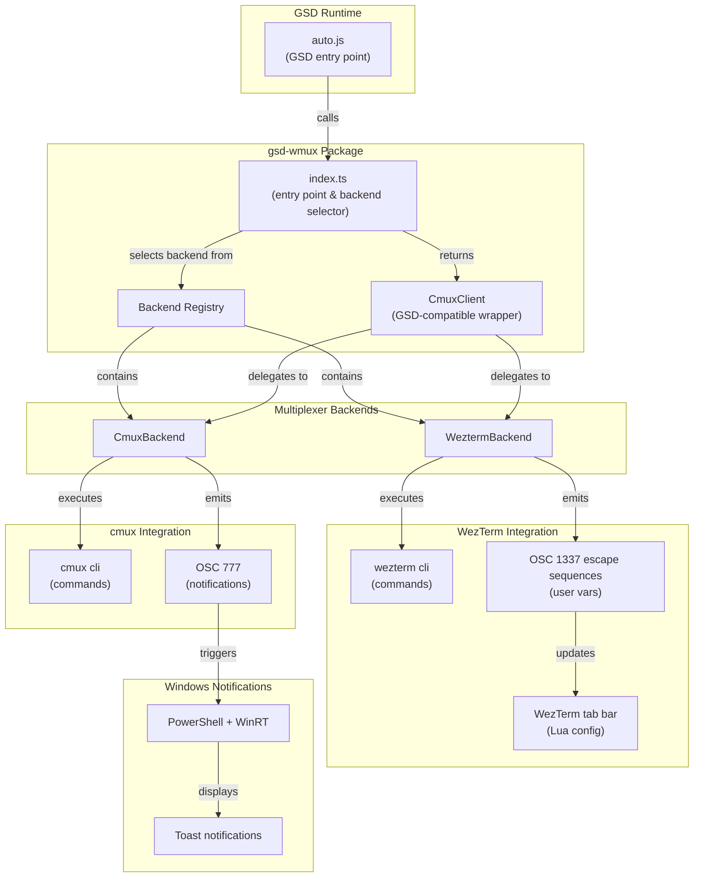
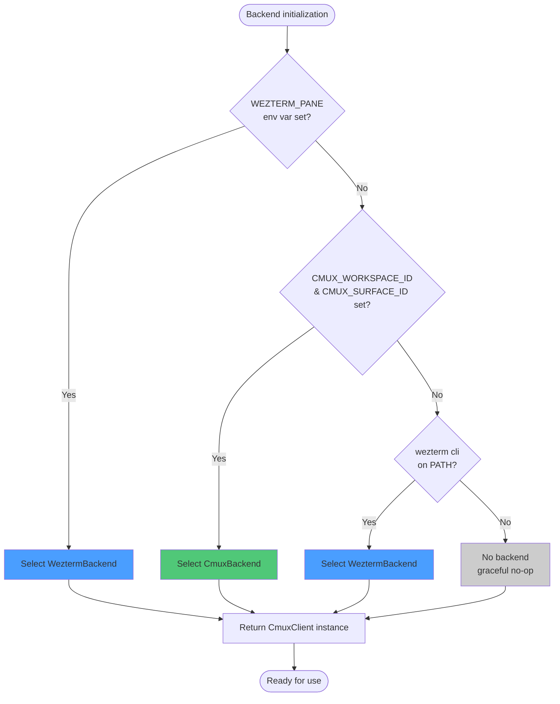
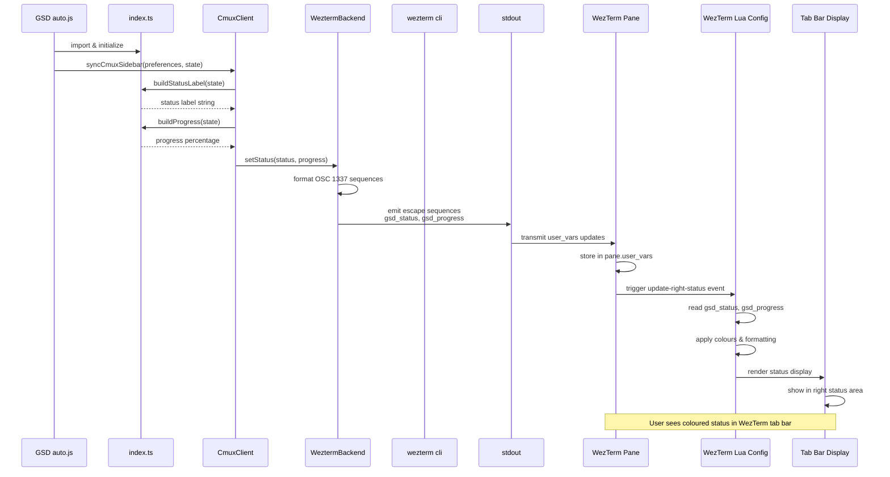
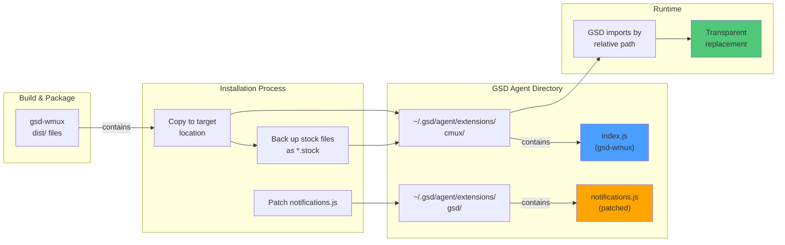
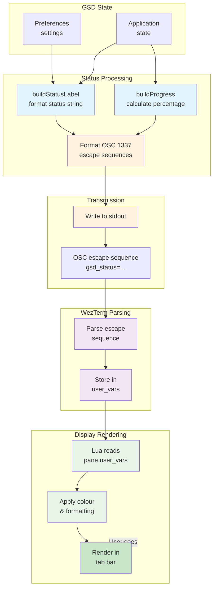

# gsd-wmux Architecture

## Overview

gsd-wmux is a Node.js TypeScript package that provides a drop-in replacement for GSD/pi's built-in `@gsd/cmux` library. It adds WezTerm and cmux multi-backend support with automatic backend detection, allowing GSD to work seamlessly across different terminal multiplexers whilst maintaining full API compatibility.

## System Architecture

### Key Components

- **GSD auto.js**: The main entry point for GSD, which imports and initialises the multiplexer abstraction
- **index.ts**: gsd-wmux entry point that performs backend selection and returns a standardised CmuxClient instance
- **Backend Registry**: Maintains references to available backend implementations
- **CmuxClient**: Implements the standard GSD cmux interface, delegating to the selected backend
- **WeztermBackend**: Native WezTerm integration using `wezterm cli` commands and OSC escape sequences
- **CmuxBackend**: cmux terminal multiplexer integration
- **WezTerm Lua Config**: User-customisable Lua configuration that reads OSC 1337 user variables and renders status in the tab bar
- **Notification System**: Windows toast notifications via PowerShell WinRT APIs (patched)

## Backend Auto-Detection Flow

### Detection Priority

1. **WEZTERM_PANE environment variable**: If set, WezTerm backend is selected (running inside WezTerm)
2. **cmux environment variables**: If both `CMUX_WORKSPACE_ID` and `CMUX_SURFACE_ID` are set, cmux backend is selected
3. **wezterm CLI availability**: If `wezterm cli` is available on the PATH, WezTerm backend is selected as a fallback
4. **No backend**: If none of the above conditions are met, the package initialises in a graceful no-op state

This priority ensures that the most specific environment takes precedence, with sensible fallbacks.

## Status Publishing Sequence

### Data Flow Details

1. GSD calls `syncCmuxSidebar()` with current preferences and application state
2. CmuxClient formats status information via helper functions
3. The selected backend formats this data into appropriate escape sequences
4. For WezTerm: OSC 1337 sequences are emitted to stdout as user variable assignments
5. WezTerm receives these escape sequences and stores them in `pane.user_vars`
6. The user's WezTerm Lua configuration reads these variables via `pane:get_user_vars()`
7. Status is rendered in the tab bar with custom colours and formatting

## Installation Architecture

### Installation Steps

1. **Build**: Compile TypeScript sources to JavaScript in `dist/`
2. **Backup**: Create backup copies of stock GSD cmux files with `.stock` suffix
3. **Deploy**: Copy gsd-wmux compiled files to `~/.gsd/agent/extensions/cmux/`
4. **Patch**: Patch `~/.gsd/agent/extensions/gsd/notifications.js` to support Windows toast notifications via PowerShell WinRT
5. **Runtime**: GSD imports the cmux extension by relative path, transparently using gsd-wmux instead of the stock implementation

### File Locations

- **Source files**: `dist/index.js`, `dist/client.js`, etc.
- **Target location**: `~/.gsd/agent/extensions/cmux/`
- **Stock backups**: `~/.gsd/agent/extensions/cmux/*.js.stock`
- **Patched notifications**: `~/.gsd/agent/extensions/gsd/notifications.js`

## Data Flow: Status Update to UI

### Processing Stages

1. **GSD State**: Application state and user preferences from GSD
2. **Status Processing**: Format human-readable status and calculate progress percentage
3. **OSC Formatting**: Convert status data into OSC 1337 escape sequence format
4. **Transmission**: Write escape sequences to stdout (captured by terminal emulator)
5. **WezTerm Parsing**: Terminal parses escape sequences and stores data in pane user variables
6. **Display Rendering**: Lua configuration reads user variables and renders formatted status in tab bar

## Backend Implementations

### WeztermBackend

Integrates with WezTerm via:
- **CLI commands**: `wezterm cli` for pane/window operations
- **OSC 1337 escape sequences**: For user variable storage
- **Direct stdout writes**: For transmitting escape sequences to WezTerm

Capabilities:
- Set status labels via user variables
- Update progress indicators
- Send notifications (via OSC 777)

### CmuxBackend

Integrates with cmux via:
- **cmux CLI**: For multiplexer operations
- **Environment variables**: For session/workspace context
- **PowerShell notifications**: Windows-specific toast notifications

Capabilities:
- Set window names and status
- Manage pane commands
- Cross-pane communication

## Integration with GSD

gsd-wmux maintains full API compatibility with GSD's `@gsd/cmux` library:

- **CmuxClient class**: Implements the standard interface expected by GSD
- **Configuration methods**: `configure()`, `setConfig()`, etc.
- **Status methods**: `syncCmuxSidebar()`, `setStatus()`, etc.
- **Graceful degradation**: Package operates as a no-op if no backend is available

This compatibility ensures that GSD can use gsd-wmux as a drop-in replacement without code changes.

## Environment Variables

### Detection Variables

- `WEZTERM_PANE`: Set by WezTerm when running inside a pane; indicates WezTerm backend should be used
- `CMUX_WORKSPACE_ID`: Set by cmux; part of detection for cmux backend
- `CMUX_SURFACE_ID`: Set by cmux; part of detection for cmux backend

### Configuration Variables

- `GSD_DEBUG`: Enable debug logging (optional)
- `GSD_BACKEND`: Force specific backend selection (optional override)

## Error Handling and Fallbacks

- **Missing backends**: If no multiplexer is detected, package initialises in no-op mode; GSD continues functioning but without status updates
- **CLI unavailable**: If `wezterm cli` or `cmux` is not on PATH, backend gracefully degrades to next priority
- **Invalid environment**: If environment variables are malformed, detection moves to next option
- **Notification failures**: Windows toast notifications are non-critical and do not block execution

## Performance Considerations

- **Lazy CLI invocation**: Backend commands are only executed when GSD calls status-related methods
- **Minimal overhead**: gsd-wmux adds minimal processing overhead to GSD's operation
- **Buffering**: Status updates are batched to reduce CLI invocations
- **No blocking operations**: All backend operations are designed to be non-blocking

## Security Considerations

- **No credential storage**: gsd-wmux does not store or manage credentials
- **Limited privilege escalation**: Windows notifications do not require elevated privileges
- **User variable isolation**: WezTerm user variables are pane-scoped and do not leak across sessions
- **Safe CLI execution**: Backend commands are executed in the current user context only
